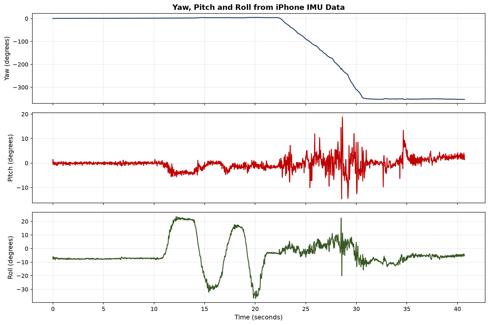

# yaw-pitch-roll-estimator-
Yaw, Pitch and Roll estimation from iPhone IMU data using Python 
# Yaw, Pitch & Roll Estimator from iPhone IMU Data

## What this project is
A Python script that estimates the 3-axis orientation (yaw, pitch, roll)
of a moving object using raw IMU sensor data recorded from an iPhone 13.
IMU sensors of this type are used in automotive ESC, ABS, and ADAS systems.

## What I did
- Recorded real IMU data using Physics Toolbox Suite on iPhone 13
  (G-Force + Gyroscope, 100Hz sampling rate)
- Calculated pitch and roll from accelerometer data using arctan trigonometry
- Estimated yaw by integrating gyroscope Z-axis angular velocity over time
- Quantified gyroscope drift during a stationary period

## Results

## Key finding
Gyroscope drift measured at 0.1495 degrees per second during stationary
period — projecting to 8.97 degrees of drift over 60 seconds. This is
the core limitation of gyroscope-only yaw estimation and exactly the
problem that sensor fusion techniques like the Kalman filter solve
in real vehicle dynamics applications.

## Tools used
Python, pandas, numpy, matplotlib

## Next steps
- Implement a complementary filter to fuse accelerometer and gyroscope
  data and reduce yaw drift
- Apply to real vehicle test data from a proving ground test campaign

quantified gyroscope drift at 0.15 degrees/second — connecting to the
sensor fusion problem solved by Kalman filtering in automotive ESC systems"
